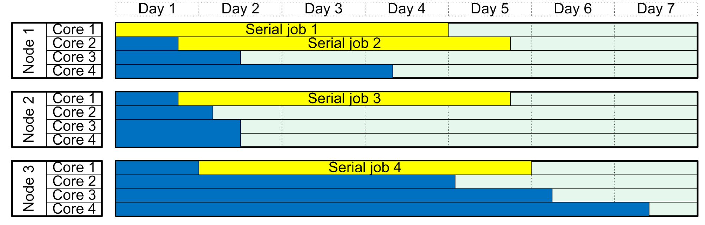
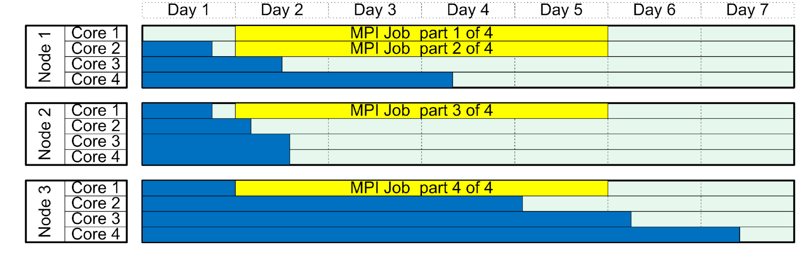
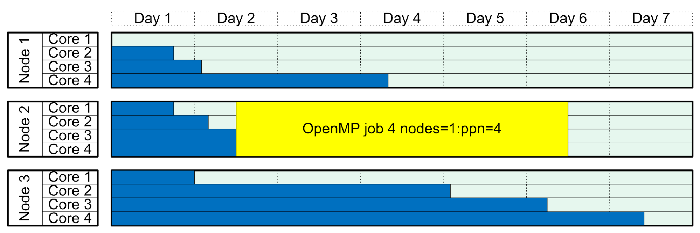
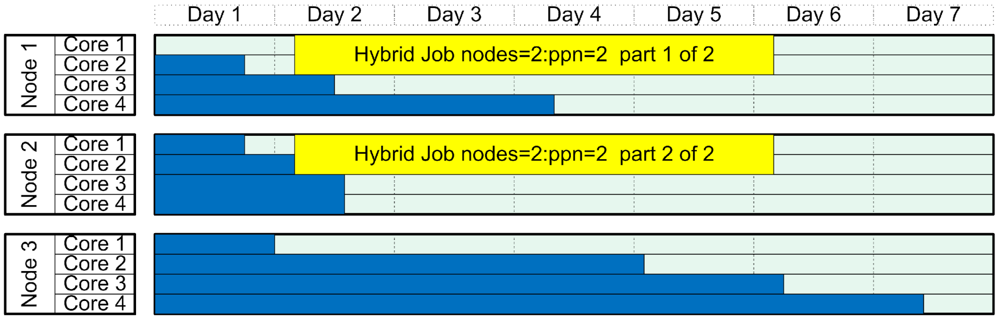

## What is Parallelism and why might I want it?

We always want our programs to run faster. One way to do this is to
buy faster computers. Another way (which we'll discuss later) is to
optimize the compilation of our programs. Yet another way is to revise
the structure of our programs to run faster.

Parallelism is simply the art of performing computational work on
multiple CPUs at the same time to boost performance.

Parallelism is good.

## Parallel computing choices

There are a number of different ways to use parallelism to
perform compuational work:

* You could run many serial jobs on a cluster at the same time. This is a good strategy if none of your jobs have dependencies on each other. An example of this stategy is a *parameter sweep*: you run the same program with different inputs.
* Your job could use a *shared memory* strategy. This is the situation where your program uses many processors on the same node, and each processor can access all of the memory used by the program. A very widely used library for doing this kind of parallelism is **OpenMP** (Open Multi-Processing).
* Your job could have a *distributed memory* job type: each processor has it's own memory that is private to it, and no other processor can see this memory. In order to communicate what is in a processor's memory space to another processor, the processes "pass messages" to each other. With this design, the code is modularized in a way that parts of the program can run on multiple different machines (nodes), each machine having to work with it's own memory space. In fact, even on a single node, each processor has it's own segregated memory space. A popular library for implementing this type of parallelism is called **MPI** (Message Passing Interface). We'll talk a bit more about this type of job in the next section.
* Your job might follow a hybrid/mixed strategy: memory is distributed among the nodes, but on each node the code can use a shared memory strategy. This could be a case where you want to use MPI to pass messages between each node, but on each node you use a shared memory strategy using MPI.

The following image summarizes the differences between MPI and OpenMP:


This table summarizes some situations that might drive your choice of parallel programming library:

|            | 1 Node     | N Nodes         |
|------------|------------|-----------------|
| **1 CPU**  | Serial job | MPI             |
| **N CPUs** | OpenMP     | MPI, or Hybrid/advanced |

## Impact of choices of parallel job type on scheduling.

### Running many serial jobs

In terms of scheduling, this is the best situation to be in, because
you can submit each job separately. Each of the jobs will be asking for
a single CPU, and will have different start times.

In your Slurm submission script, you will have a line that looks like:

```
#SBATCH        --ntasks=1
```



### Running a distributed memory job (e.g. MPI) 

Because each process of this kind of job has it's own private
memory space, these sorts of jobs can run on multiple machines and
can scale up in size more easily than other parallelism types.

In terms of scheduling, each process has to start at the same time
so need to fit in a block of many processors, potentially on
different machines, and is harder to schedule than using many
serial jobs.



### Running a shared memory job (e.g. OpenMP) 

On a single machine, all of the threads start at the same time
so need to fit in a block of many processors on the same machine.



### Running a mixed, hybrid job (e.g. OpenMP) 

Multiple blocks on multiple machines need to be available for
this job to run.


