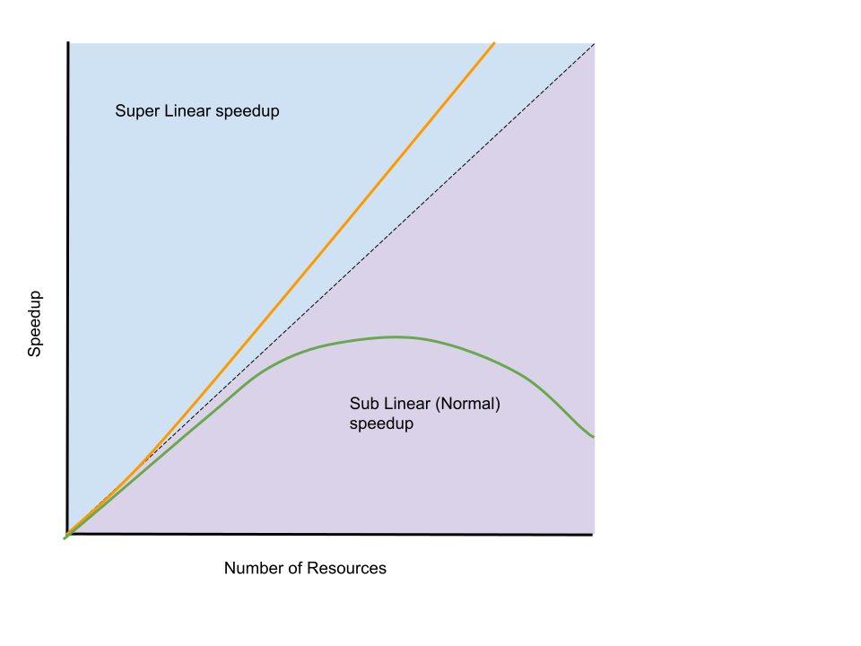
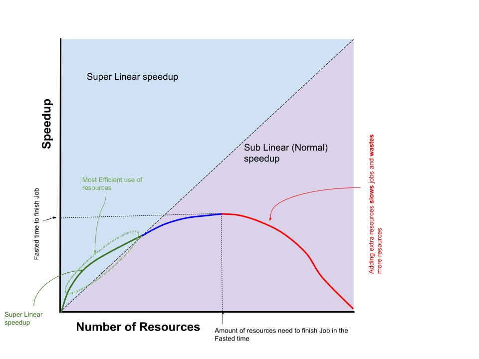

## Using the `time` command to benchmark code

We use the `time` command as an easy way to figure out how long our program ran. The `time` command 
can be used to time any command we can run at the shell, even trivial ones:

```
time echo "Howdy"
```
{: .bash}

```
Howdy

real    0m0.000s
user    0m0.000s
sys     0m0.000s
```
{: .output}

The measurement we are interested is **walltime** -- it shows up on the row that starts with `real`. This is the actual time the code was running, from start to finish. (The word **walltime** can be interpretted as "the time we observe looking at the time on the wall". As computational researchers who want results as fast as possible, this is the measurement type that is most important to us.

The other two rows in the output are `user` and `system` measurements of CPU time. They report how much CPU time the code used (`user`), and how much time the operating system kernel spend servicing the program (`system`). They are more difficult to interpret, and we won't discuss them today.

The `echo` command clearly isn't doing too much, so it takes very little time to run.
Lets compile a program that takes a non-trivial amount of time to execute.

```
mpif90 -o benchmark-demo-mpi benchmark-demo-mpi.f90 -O0
```
{: .bash}

The last part of the line is "minus oh zero" (a capital letter `O` followed by the number `0` after the minus sign). It tells the compiler that we want it to do very few optimizations while compiling our code.

For GNU compilers, this (`-O0`) is the default optimization level -- it generates slower code, but is quick to compile.

For fun, lets compile it again, but now we will time the compilation:

```
time mpif90 -o benchmark-demo-mpi benchmark-demo-mpi.f90 -O0
```
{: .bash}

```

real    0m0.747s
user    0m0.266s
sys     0m0.167s

```
{: .output}

We can now time the execution of this program using a single processor:

```
time ./benchmark-demo-mpi
```
{: .bash}

```
  sum=   43788682263742496.     

real     0m8.943s
user     0m7.207s
sys      0m0.065s
```
{: .output}

Ideally, we would like to time our runs on a system with **no other users** on them -- otherwise the computational work done by others might influence the performance of your program as your program competes for resources with their programs. Timing on an isolated system also gives us a better chance that our timing is **reproducible**.

## Compiler optimizations

As mentioned previously, most compilers allow a choice for optimization level. We previously compiled with the flag `-O0` to produce the least optimized code.

There are higher optimization levels, namely `-O1`, `-O2`, and `-O3` (the highest). The more you allow the compiler to optimize your code, the longer it will take to compile, but the reward is usually a program that runs faster (sometimes significantly so).

Let's recompile our program with the highest optimization level:

```
time mpif90 -o benchmark-demo-mpi benchmark-demo-mpi.f90 -O3
```
{: .bash}
```

real    0m1.767s
user    0m0.233s
sys     0m0.116s

```
{: .output}

Now when you time your program again, you will likely see a drastic reduction in execution time:

```
time ./benchmark-demo-mpi
```
{: .bash}

```
  sum=   43788682263742496.     

real     0m1.519s
user     0m0.921s
sys      0m0.055s
```
{: .output}

Note: sometimes the compiler will take too many short cuts when optimizing code at high levels. It's always important to check that the answers from your program make sense!

## How many processors should I run my code on?

While we would like to speed up our program runs as much as we can, not all programs can make efficient
use of a large number of CPUs. At some point, the impact of the serial parts of your code, and the impacts
of interprocess communication will cause the efficiency of your program to decrease as you throw more
processors at a program. In some cases, adding additional processors for your program to use can actually
slow things down!

Worse though, the more processors you ask for, the less likely you will run soon in our cluster batch system.
The time you hope to save by using more processors may actually be replaced by time waiting for your job to run,
as other users might have more priority than you.

One final note: computational clusters are a shared resource, so each additional core you ask for is one
that blocks another user from running a job. If you know that asking for an additional core will only have a very
small effect on your total running time, let another user use that core instead. By only asking for what we
reasonably need, we can all have our jobs run sooner!

## Parallel Speedup and Efficiency

We've already mentioned walltime, but there are some other metrics we can use to evaluate the
performance of our parallel code.

### Speedup

In parallel computing, **speedup** is defined as the ratio of the walltime used to run a serially
on one core (`T_s`) divided by the walltime taken to run a parallel version of the program on
`p` processors (`T_p`):

```
S = T_s / T_p
```

(The strict definition assumes the programs are the best possible algorithms in both cases.)

For example, if a serial program takes two hours to run, and with 4 processors it takes one hour,
the speed up is `S = T_s / T_4 = 2 / 1 = 2`. Using four processors instead of one made the code
run **2 times faster**. In a perfect world, we would have liked to have the code run **4 times faster**
on 4 processors.

We can run our code with varying numbers of processors to generate a speedup profile, and
plot the number of processors against the speedup (see below).

When the speedup is exactly equal to the number of processors we give to the parallel task, we call
this **linear speedup** and we call the task **embarrassingly parallel**. An example of a task that
is often considered to be close to embarassingly parallel is the rendering of 3D computer graphics: generating images from
3D geometry using lighting and shading algorithms (provided that each processor renders a sampling
of the pixels of the same complexity).

In reality, most parallel programs don't exhibit linear speedup, and the speedup will be
less than the number of processors given to do the work. In this case the speedup is called
**sublinear**.

Very rarely, the speedup of a parallel task will be greater than the number of processors the
program is run on, and this is called **superlinear** speedup. This might happen if moving the
work to multiple processor improves memory access -- for example, if the serial process was
taxing the memory of a single computer, and moving to multiple nodes alleviated the problem,
then the speedup might look superlinear.

The following graphs shows these speedup types:



What typically happens in practice is that as you throw more processors at
a problem, the speedup becomes worse and worse. You may see superlinear
speedup at a low number of processors (but not likely), and that initial
advantage will decay as more processors are added -- at some point adding
more processors will reduce the running time as the influence of the serial parts
of your code dwarf the influence of the parallel parts (see Amdahls Law):



### Efficiency

The **efficiency** of a parallel program is defined as the speedup divided
by the number of processors. This intuitively gives a measure of how well each
processor was utilized. In the linear speedup case, the efficiency with be
**1.0** (**100%** efficient). In the sublinear case, the efficiency will be less than one
and in the superlinear case, the efficiency will be greater than one.

In the example above, the speed up was 2.0 on 4 processors, so the parallel efficiency
of the code is 50% (0.5).

> ## Interpreting speedups and efficiency
> This webpage has some javascript that plots the walltime, speedup, and efficiency
> of a parallel code:
>
> [https://jsfiddle.net/cwant/rf48toug/](https://jsfiddle.net/cwant/rf48toug/){:target="_blank"}
>
> The walltime for various runs on 1, 2, 4, 8, and 16 processors are in the Javascript
> frame of the page.
>
> Given the timings and the graphs, how many processors would you run the code on?
> To answer this you, will need to think about what is important to you: having
> your code run as fast as possible, or do you care about efficiency?
> Another important consideration when thinking about this: are you only running this job once? What if you need to run this type of job ten thousand times?
{: .challenge}

## Submitting a job to time execution of a parallel code

Included with the workshop files is a job submission script called. `submit-benchmark-job.sh`.
Take a look at this script: it executes and computes the running time of the benchmark program we compiled above on 1, 2, and 4 processors.
It writes the timing information to the file `out.time`. Submit this job to slurm:

```
sbatch submit-benchmark-job.sh
```
{: .bash}

When the job finishes, check out the lines in the file `out.time` that have the word `real`:

```
grep real out.time
```
{: .bash}
```
real    0m8.100s
real    0m4.473s
real    0m3.054s
```
{: .output}
This will give you the timings on one, two and four processors.

> ## Graphing your times
> Revisit the website with the Javascript speedup grapher mentioned above,
> and replace the timings with the timings you get for one, two and four processors
> (delete the lines with eight and sixteen processors).
> Press the run button to generate the walltime, speedup, and efficiency graphs
> for your benchmark runs.
{: .challenge}
